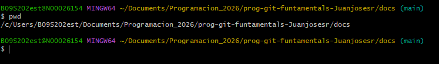
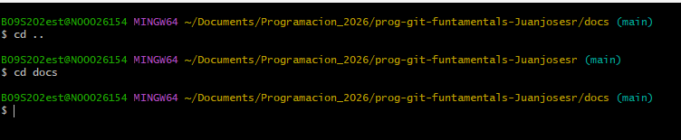
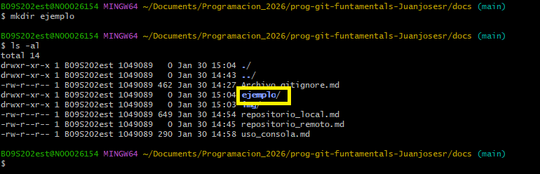
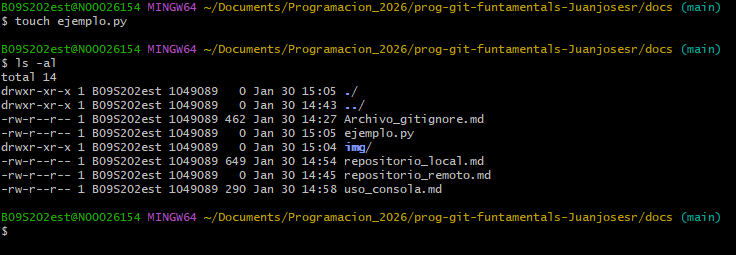

# como navegar, crear directorios y archivos  
lista de comando
- pwd saber ubicación actual con ruta completa  
- ls -al saber todos los archivos y carpetas que hay en la carpeta actual  
- cd / cd .. entrar o salir de una carpeta  
- mkdir crear una carpeta  
- touch crear un archivo 

